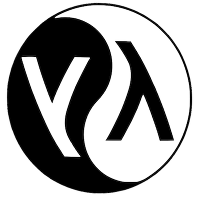

autoscale: true

# Why Functional Programming matters?



---

## [fit] Hello, World!


- __Diego Freniche__ (@dfreniche)
- 100% remote dev @ Mobile Jazz (iOS / Android)
- SCJP 1.5, SCJP 1.6, SCWCD 1.5, SCBCD 1.3, Itil Foundations [^1]

[^1]: CV: `git clone http://www.github.com/dfreniche/cv`


---

## F.P.

- invented in the 50's (1958)
- only ALGOL is older
- derived from the _Lambda Calculi_ (developed in the 30's)

---

## LISP in College

- Lost In Stupid Parentheses
- Lots of Irritating Superfluous Parentheses
- ... 
	


---

## A word (or two) on LISP


- simplest syntax for ANY programming language
	
- Code:
	
```lisp
(+ 3 2)
```

- List of data:

```lisp

'("hello", "world")

```

---

## A word (or two) on LISP

- __homoiconicity__: "the structure of program code is represented faithfully and directly in a standard data structure"
- we have direct access to the compiler's AST
- Much power. So cool. Such compiler. Wow

---

## Eval: treat data like code, code like data

- Eval: treat data like code, code like data

```lisp

CL-USER> '(+ 3 4)
(+ 3 4)
CL-USER> (+ 3 4)
7
CL-USER> (eval '(+ 3 4))
7

```

http://learnlispthehardway.org/try-lisp/

---

## Ideas piooneered by LISP

- tree data structures
- automatic storage management
- dynamic typing
- conditionals
- higher-order functions
- recursion
- the self-hosting compiler


---

## Greenspun's tenth rule [^2]


> Any sufficiently complicated C or Fortran program contains an ad hoc, informally-specified, bug-ridden, slow implementation of half of Common Lisp.

[^2]: https://en.wikipedia.org/wiki/Greenspun%27s_tenth_rule

---

## F.P. is back!

- Closures & High Order Funcions in Swift. Inmutability. Optionals.
- Blocks in Objective-C to mimic Closures.
- Scala
- C# / F#
- JavaScript?


--- 

## Being a Functional Language vs. having Functional Constructs


> _There's no accepted definition of functional programming language._
> _
> _If you define functional language as the language that supports first class functions and lambdas, then yes, JavaScript *is* a functional language.[^3]_

[^3]: http://stackoverflow.com/questions/3962604/is-javascript-a-functional-programming-language

---

## Functional Programming

... functional programming is a programming paradigm ... that treats computation as the __evaluation of mathematical functions__ and __avoids changing-state and mutable data__. It __is a declarative programming paradigm__,

---

## Functional Programming


... the output value of a function __depends only on the arguments that are input to the function__, so calling a function f twice with the same value for an argument x will produce the same result f(x) each time __eliminating side effects__

https://en.wikipedia.org/wiki/Functional_programming

---

# OK, Something practical, please?

---

## Inmutability, avoiding state, don't shoot yourself in the foot

- Benefits of value types and immutability
    - compiler can optimize your code
    - eats more memory, optimizes _programmer's_ time

---

## Inmutability

- Diego's dumb rule 

> _Declare everything as a constant, let compiler warn you when you're changing something. That's a variable._

In Java:

```java

final String s = "";

s = "other thing"; // nope

```

---

## Inmutability

- nice to avoid stupid mistakes

```java
public void downloadImage(String imageUrl) {
    imageUrl += "?something=10";    // don't do this
}

public void downloadImageInmutable(final String imageUrl) {
    imageUrl += "?something=10";    // now you can't do stupid & ugly things
}
```

---

## Inmutability

- why so final?
- closures, anyone?


---

##Inmutability

```java
protected void onCreate(Bundle icicle) {
    // more code here, including a call super antipattern...

    final Person diego;
    button.setOnClickListener(new View.OnClickListener() {
        public void onClick(View v) {
            // Perform action on click
            
            // use Person object
            diego.name = "Diego";           // OK
            diego = new Person("Groucho");  // nope
        }
    });
}

```


---

## Use nice annotations (if possible)

- annotations war

```java
import com.sun.istack.internal.NotNull;

...

public void downloadImage(@NotNull String imageUrl) {
    imageUrl += "?something=10";    // don't do this
}

public void downloadImageInmutable(@NotNull final String imageUrl) {
    imageUrl += "?something=10";    // now you can't do stupid & ugly things
}

```

---
    
## Why you hate FP

- Functional programming is declarative
- say _what you want_, not _micromanage how to do it_
- you're already doing it!
    - SQL
    - CSS
    - Regular expressions

---


## High order functions

- Functions that take functions as parameters
- Map, Filter, Reduce, Flatmap
- _Let's do something with these fruits_


---

## Map

- "Do *THIS* to every single element in the list"
    - __add 1__ to every element in __this list__
    - __takes__ a function (add one) & a list
    - __returns__ a list
- _with a basket of fruit: peel every fruit in this basket_
- think of __SQL update__  

---

## Map example

```swift
let numbers = [1, 2, 3, 4, 5, 6]

numbers.map { (e: Int) -> Int in
    return e + 1
}


```


---

## Reduce

- __takes__ a function (add) & a list
- returns just __one__ element
- _make multi-fruit juice_
- think of AVG function in SQL


---

## Reduce example

```swift

let numbers = [1, 2, 3, 4, 5, 6]

numbers.reduce(0, combine: +) --> 21

```


---

## Filter

- "I only want oranges from that basket"
- SQL select WHERE clause

---

## Filter example

```swift
let numbers = [1, 2, 3, 4, 5, 6]

let result = numbers.filter({$0 % 2 == 0})

result --> [2, 4, 6]


```

---

## Flatmap

- Like map, but also "flattens" the list
- _some of the fruits in the basket are wrapped with paper_

---

## Flatmap example

```swift

// how do you add 2 to all the numbers in this array?

let fa2 = [[1,2],[3],[4,5,6]]

let fa2m = fa2.flatMap({$0}).map({$0 + 2})
fa2m


```


---

## So what?

- you don't need to be an athlete to run and be healthier
- you don't need to be "purist" to benefit from some FP goodness


---

## So what?

- use inmutable structures where possible
- in Java, for example, final everything
- in Swift, prefer __structs__ vs classes


---

## So what?

- map / filter / reduce helps sometimes
- not everything is a for loop
- use the best of OOP + the best of FP

---

# Bonus tip!

---

## Classic thinking

We have n tags. Need to show only thre first three.

```objectivec
- (NSArray <NSString *> *)firstThreeHashtags {
    NSMutableArray <NSString *> *result = [[NSMutableArray alloc] init];
    
    for (NSString *hastag in self.hashtags) {
        if (hastag.length > 0) {
            [result addObject:hastag];
        }
        if ([result count] > 2) {
            break;
        }
    }
    return result;
}
```

---

```objectivec

## Tell what you want what you really really want...

- (NSArray <NSString *> *)firstThreeHashtags {
    NSUInteger rangeMax = MIN(3, self.hashtags.count);
    return [self.hashtags subarrayWithRange:NSMakeRange(0, rangeMax)];
}
```

---

# Thanks!
